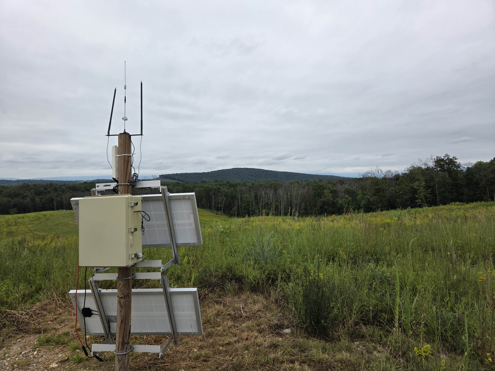

# scarecro-system

The SCARECRO (Sensor Collection and Remote Environment Care Reasoning  Operation) documentation and source code files for integrating a variety of off-the-shelf IoT sensors into a broader collection, storage, and visualization framework. 

## Purpose
The purpose of the SCARECRO system is to provide open-source, low-cost, flexible, and farmer and environmental manager focused tools for precision agriculture wireless sensing networks. More specifically, the SCARECRO system aims to accomplish the following goals:
- Provide abstractions (and example implementations) for a variety of wired and wireless communication protocols to make off-the-shelf sensor development less painful 
- Provide clear methods of integrating a variety of hardware and software sources into common infrastructure
- Prefer and develop for open-source or generous free-tier infrastructure options whenever possible 
- Bake in the flexibility to switch system components to different implementations without high programming overhead to meet individual needs
- Provide useful and timely documentation and tutorials for implementing the system in a variety of configurations
- Study and document low-cost hardware implementations of the system to provide better wireless sensor network access for budget constraints 
- Continuously add to and improve the system as we gain more experience in the field 

## Quick Links 
- [Build an Outdoor Solar-Powered Raspberry Pi Unit](docs/gateway_hardware_build.md) 

## Repository Structure
The structure of the repository is as follows: 
- **docs**: contains the documentation files for the project 
    - **carrier_docs**: documents individual implemented carriers
    - **handler_docs**: documents  individual implemented handlers
    - **imgs**: contains image files for display in the documentation 
    - **task_docs**: documents individual implemented tasks
- **scarecro**: contains the system source files for the project. This repository can be downloaded separately if the overhead of the documentation is too much for an installed system (for instance, if you have a memory-limited raspberry pi)
    - **configs**: Where configurations for your specific SCARECRO system are stored. Most files (other than the init.py file and some example configurations which are coming soon) are gitignored since the configuration will contain project-specific information that may be confidential (connection strings, authentication, etc). 
        - **addresses**: contains json files for addresses (no direct corresponding source code). Addresses are most important part of configuring the system as they tie together messages, carriers, handlers, and sometimes route task info. 
        - **carriers**: contains json files for carrier configurations (generally directly corresponding to source code files)
        - **handlers**: contains json files for handler configurations (generally directly corresponding to source code files)
        - **messages**: contains json files for message definitions 
        - **other**: location for any other potentially needed configurations. 
        - **system**: contains the main json system file. Only one file, system.json, is expected here, and contains the relevant active addresses and tasks for the entire system 
        - **tasks**: contains json files for tasks (no direct corresponding source code). Tasks are also important in configuring the system as they perform most system management obligations and route data. 
        - **updater**: optional json configuration for updating configurations at an management level, especially for multiple systems with different configuration needs. 
    - **examples**: contains useful examples that can be used as a starting point to initialize a system. 
        - **example_configs**: contains example configuration files for specific systems setups
        - **example_instances**: contains example sensor instance files 
        - **example_messages**: contains example sensor message files 
        - **schemas**: contains the schemas used in SCARECCRo for messages, files, instances, and tags
        - **scarecro_pi.service**: example service file to run scarecro system on pi at startup
        - **scarecro_ubuntu.service**: example service file to run scarecro system on ubuntu service at startup
        - **verify_instance_schema.py**: helper script to verify a instance object meets the schema
        - **verify_message_schema.py**: helper script to verify a message object meets the schema 
    - **generated_data**: Most files in this repo are gitignored. Provides a useful place to store files generated by the SCARECRO system (such as camera images, logs, connection_info, etc)
    - **src**:
        - **carriers**: contains python source code files for carrier objects (which generally connect to some sort of wired or wireless protocol)
        - **handlers**: contains python source code files for handler objects (which generally provide data translation/transformation or cleaning operations)
        - **other**: contains any other needed python source code files 
        - **system**: contains the python source code file(s) for the system object. We do not recommend modifying the system object except for developers with experience in using the SCARECRO system 
        - **tasks**: contains python source code files for task objects 
    - **tests**: contains python test files which can be run separately to test different components of the system in isolation, if need be. Generally all tests assume the system will run in debug mode. 
        - configuration_tester.py: Contains a useful utility function (run_configuration()) which takes in a system configuration and runs the system on that configuration in debug mode. This is useful if your test just needs to test a given configuration of the system and not other behavior. 
    - **util**: contains utility python source code files. For instance, a lot of time functionality is contained in the main util.py code file. 
    - scarecro.py: Main python code file for starting up a a scarecro system. Will be reference in upcoming scarecro.service file. 
    - system_object.py: Storage variable for scarecro system object which is initialized in the system. 
 

## Documentation 
### How the System Works 
There are several principal abstraction components of the SCARECRO system: messages (abstractions on which information packets are based), carriers (abstractions of communication protocols on which packets are sent/received), handlers (abstractions of messaging operations such as translation, transformation, and cleaning), tasks (abstractions of functional operations to keep the system running depending on how it is configured), the system (which manages all components together), and an optional updater (a meta-system management component)

- [SCARECRO System Overview:](/docs/system_overview.md) This file gives a comprehensive overview of how all the components work in the SCARECRO system. 
- [Example System Configuration](/docs/example.md)
- [Messages](/docs/messages.md)
- [Addresses](/docs/addresses.md)
- [Carriers](/docs/carrier_class.md)
- [Handlers](/docs/handler_class.md)
- [Tasks](/docs/task_class.md)
- [System](/docs/system_class.md)
- [Updater](/docs/task_docs/updater_class.md)

### Software Setup and Installation
- Install a SCARECRO gateway on a Raspberry Pi
- [Install a SCARECRO cloud unit on a Linux computer](docs/cloud_server_setup.md) 

### Hardware Setup and Installation 
- [Building an outdoor solar-powered raspberry pi-based SCARECRO gateway](docs/gateway_hardware_build.md) 

### The Data Gator 
The Data Gator is a sensor aggregator which can support wired and wireless sensors. It can be used as a standalone sensing unit or a method of extending the range and/or sensor interfaces available on the gateway. [You can find the Data Gator project repository here.](https://github.com/Data-Gator)

### Databases
Currently we use [MongoDB](https://www.mongodb.com/products/platform/atlas-database) as our database. In the future, we are planning to create direct integrations with SQL databases as well. 

### Dashboards
TODO 

## Project Papers and Posters
- 2023: [The SCARECRO system: open-source design for precision agriculture adoption gaps](https://brill.com/edcollchap/book/9789086869473/BP000052.xml)
- 2023: [Precision Agriculture Adoption and Integration Case Study](https://isure.uidaho.edu/wp-content/uploads/2023/03/SURF23Poster.pdf)
- 2024: [Recovery Mechanism for Real-Time Precision Agriculture Sensor Networks: A Case Study](https://www.researchgate.net/profile/Mary-Everett-3/publication/385817104_Recovery_Mechanism_for_Real-Time_Precision_Agriculture_Sensor_Networks_A_Case_Study/links/673648e24a70511f071ee042/Recovery-Mechanism-for-Real-Time-Precision-Agriculture-Sensor-Networks-A-Case-Study.pdf)
- 2024: [Data Gator: a Provision-less Network Solution for Collecting Data from Wired and Wireless Sensors](https://www.researchgate.net/profile/Mary-Everett-3/publication/385817493_Data_Gator_a_Provision-less_Network_Solution_for_Collecting_Data_from_Wired_and_Wireless_Sensors/links/6736473037496239b2bfe4a4/Data-Gator-a-Provision-less-Network-Solution-for-Collecting-Data-from-Wired-and-Wireless-Sensors.pdf)
- 2024: [Explainable Neural Network Alternatives for AI Predictions: Genetic Algorithm Quantitative Association Rule Mining](https://www.researchgate.net/profile/Mary-Everett-3/publication/385817373_Explainable_Neural_Network_Alternatives_for_AI_Predictions_Genetic_Algorithm_Quantitative_Association_Rule_Mining/links/6736447b68de5e5a30772e51/Explainable-Neural-Network-Alternatives-for-AI-Predictions-Genetic-Algorithm-Quantitative-Association-Rule-Mining.pdf)
- 2025: [Unsupervised learning to automatically determine microclimates in a vineyard](https://brill.com/edcollchap-oa/book/9789004725232/BP000103.xml)

## Project News
- 2023: [University of Idaho engineering 'smart' wine vineyard across the country](https://www.ktvb.com/article/news/local/208/local-university-of-idaho-engineering-smart-wine-vineyard-across-the-country/277-80f68315-e689-472b-80d2-34dade9d5b37)
- 2023: [Super Smart Vineyards: UIdaho Students Develop Components to Help Vintners Increase Efficiency](https://www.thecowboychannel.com/super-smart-vineyards-uidaho-students-develop-components-to-help-vintners-increase-efficiency)
- 2024: [AI-augmented system for sustainable crop production receives $120K grant](https://www.uidaho.edu/newsroom/ai-crop-system)
- 2025: [Plowing through code](https://www.uidaho.edu/newsroom/robotics-scholarship-cda-campus)

## Project Videos 
- [Cutting Edge Vineyard](https://youtu.be/J3eXdCHatec?si=T-tvNOezWmk3fvN1)
- [LoRaWAN Summer Sensor Testing 2025](https://youtu.be/f4wofvKjfo4?si=K5K3n3WF9s5c11OQ)

## Sponsors and Partners
- [Idaho State Board of Education Higher Education Research Council](https://boardofed.idaho.gov/board-facts/board-committees/higher-education-research-council-herc/)
- [Laurel Grove Wine Farm](https://laurelgrovewinefarm.com/) 
- [Sandpoint Organic Agriculture Center](https://www.uidaho.edu/idaho-ag-experiment-station/sandpoint-organic-agriculture) 