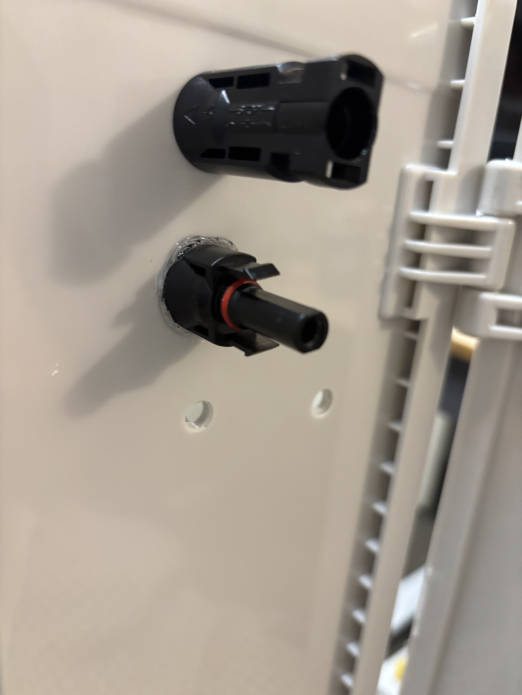
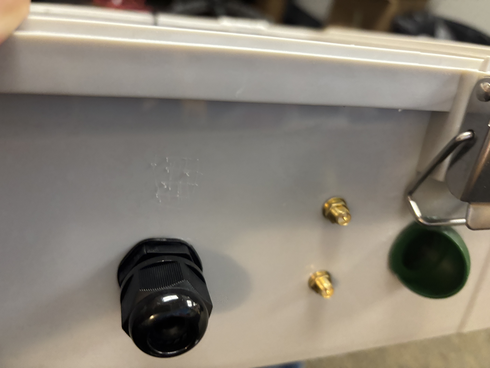
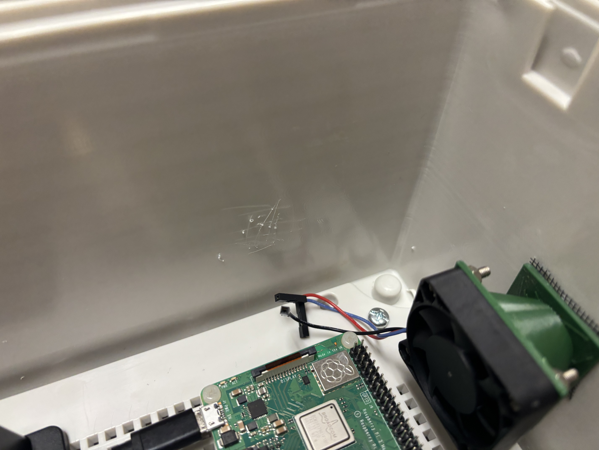
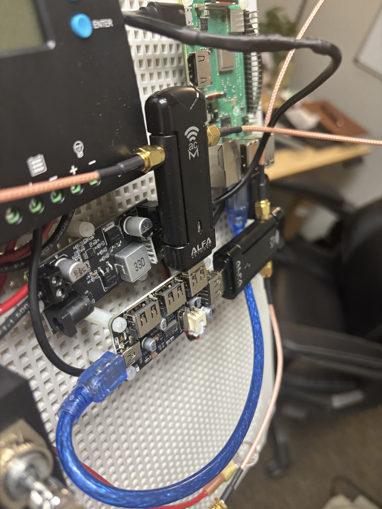
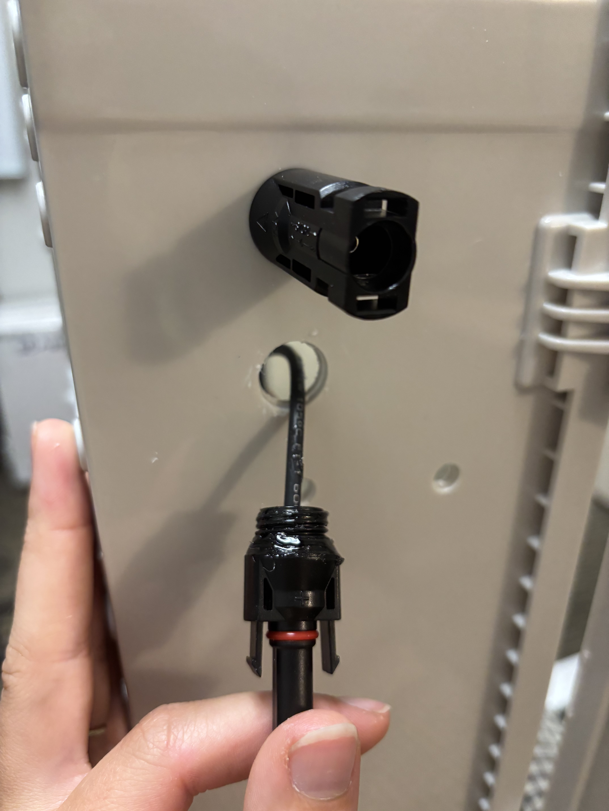
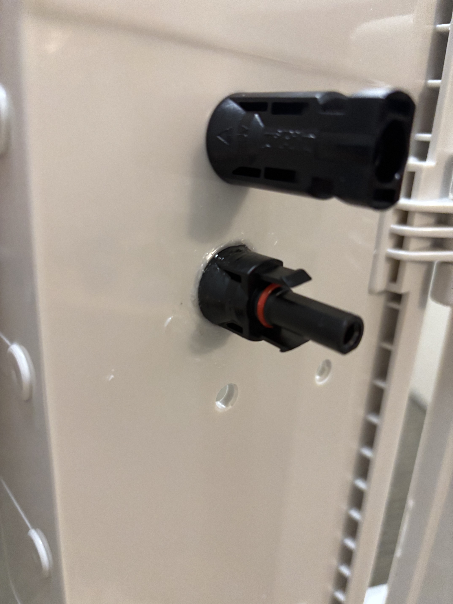
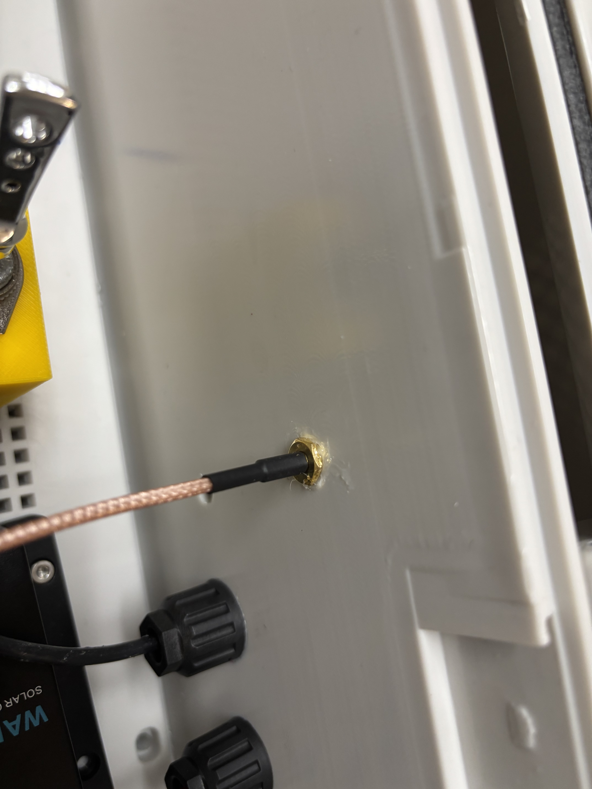
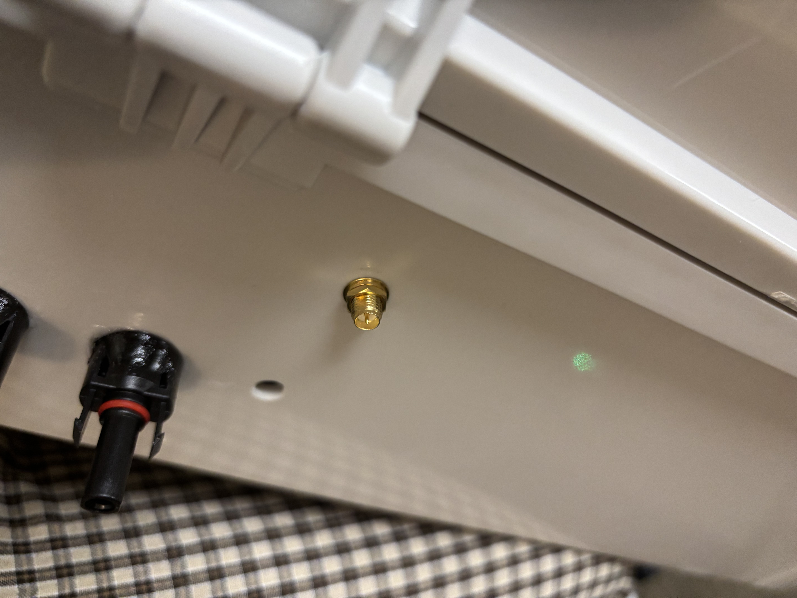

# Gateway Build Instructions

Here is how to build a SCARECRO Solar-Powered gateway.

# Steps
## Step 1: Gather Materials
You will need:
### Casing
+ Weatherproof Box: [We use this one, you may want a larger size depending on your use case](https://www.amazon.com/dp/B08ZRR2DJX/?coliid=I9XAXDFTP5UGU&colid=X0Q5HAT3SDK1&psc=1&ref_=list_c_wl_lv_ov_lig_dp_it)
### Power
#### Battery Power
+ Battery: [We use this 12V 30AH one](https://www.amazon.com/dp/B009CX09M0/?coliid=I2KJVQQAC7850H&colid=X0Q5HAT3SDK1&psc=1&ref_=list_c_wl_lv_ov_lig_dp_it) but depending on your use case, you may want more storage or a LiPo option. 
+ Battery Terminals: [We use these ones for our battery](https://www.amazon.com/dp/B01D8EJX3E/?coliid=I2JX4GD6F2LCFX&colid=X0Q5HAT3SDK1&psc=1&ref_=list_c_wl_lv_ov_lig_dp_it)
+ Battery Switch: [We use this one](https://www.amazon.com/dp/B08S34VYX6/?coliid=IO3I0J68YG0AA&colid=X0Q5HAT3SDK1&psc=1&ref_=list_c_wl_lv_ov_lig_dp_it)

#### Solar Power
+ Renogy Solar Controller: [We use this one](https://www.amazon.com/dp/B07MVZ777D/?coliid=I1DEDMWI4PJ9D1&colid=X0Q5HAT3SDK1&ref_=list_c_wl_lv_ov_lig_dp_it&th=1)
+ Renogy BT-1 Bluetooth transmitter: [We use this one](https://www.amazon.com/dp/B0894SDTSL/?coliid=I3V96M3AG6IFGC&colid=X0Q5HAT3SDK1&psc=1&ref_=list_c_wl_lv_ov_lig_dp_it)
+ M5 Solar connectors: [We use these ones](https://www.amazon.com/dp/B08P72QZFN/?coliid=I3DPOOKP8FLTP0&colid=X0Q5HAT3SDK1&psc=1&ref_=list_c_wl_lv_ov_lig_dp_it)
+ 100 Watt Solar Panels: [We use this one](https://www.amazon.com/dp/B07NVJLLZ5/?coliid=I3ISKDL40BBII5&colid=X0Q5HAT3SDK1&ref_=list_c_wl_lv_ov_lig_dp_it&th=1), you may want one or two depending on your area. 
+ Solar Extension Cables (if panels are far away): [We use these ones](https://www.amazon.com/hz/wishlist/ls/X0Q5HAT3SDK1?ref_=list_d_wl_lfu_nav_9)
+ Solar M5 Splitters (If using multiple panels): [We use these ones](https://www.amazon.com/dp/B01D7VBGY2/?coliid=ISHWCL5OJ7Q29&colid=X0Q5HAT3SDK1&psc=1&ref_=list_c_wl_lv_ov_lig_dp_it)
+ Solar Extension Cables (if panels are far away): [We use these ones](https://www.amazon.com/hz/wishlist/ls/X0Q5HAT3SDK1?ref_=list_d_wl_lfu_nav_9)

### Electronics and Connectors 
+ Raspberry Pi 3B+ : [We use this one](https://www.amazon.com/dp/B0BNJPL4MW/?coliid=I20RHRXD2RJGM4&colid=X0Q5HAT3SDK1&psc=1&ref_=list_c_wl_lv_ov_lig_dp_it)
+ SD Card (we recommend at least 32GB SD Card): [We use this one](https://www.amazon.com/dp/B083NPV66H/?coliid=I1V3CF3EBF1H26&colid=X0Q5HAT3SDK1&psc=0&ref_=list_c_wl_lv_ov_lig_dp_it)
+ Buck Converter: [We use this one](https://www.amazon.com/dp/B01NALDSJ0/?coliid=I3L5B6I86VE5O6&colid=X0Q5HAT3SDK1&ref_=list_c_wl_lv_ov_lig_dp_it&th=1)
+ Powered USB Hub: [We use this one](https://www.amazon.com/dp/B07PP91HWD/?coliid=I1MYUZD4XP3GAT&colid=X0Q5HAT3SDK1&psc=0&ref_=list_c_wl_lv_ov_lig_dp_it)
+ Cable for Renogy to USB Hub: 
    - [We use this one for 5V USB Slot to Pigtail](https://www.amazon.com/dp/B0BS6WHP3R/?coliid=I2WH969NE72V3&colid=X0Q5HAT3SDK1&ref_=list_c_wl_lv_ov_lig_dp_it&th=1) 
    - [And then this from Pigtail to JST-XH 2.54mm](https://www.amazon.com/dp/B096F5LSVL/?coliid=I1HEAGHI6256U3&colid=X0Q5HAT3SDK1&psc=1&ref_=list_c_wl_lv_ov_lig_dp_it), or you can use this directly from the buck converter
+ USB to Pi power cable (micro to A): [We use this one](https://www.amazon.com/dp/B0BHNVLW1Z/?coliid=I1VB7KAI704EHS&colid=X0Q5HAT3SDK1&ref_=list_c_wl_lv_ov_lig_dp_it&th=1)
+ USB A to mini (Pi to Hub) [You could use something like this](https://www.amazon.com/Smays-Mini-USB-Cable-Bulk/dp/B0C2BV96BB)
+ Gland connector: [You could use something like these](https://www.amazon.com/QILIPSU-Waterproof-Adjustable-Locknut-Diameter/dp/B07ZRH3V59/ref=sr_1_4?crid=2B1FZOHEYGIFW&dib=eyJ2IjoiMSJ9.E57LpE5IgrNUmpVoK-PZHyJrrRGCC_FPmhlUNnUUIqs-jAA7cR2XSwDqDDLDI6XEMmBayb3Jnt4dVgGvOhl9aNXtizJEnmi6VVr0lH6hHy8P-cTbDwxJNTQJP7WLGWReJnS9-_Nw7HWWl-uTpZKtVztf866WixFloALcO7Qzr8NDKw-I422VkDLlGmtrAXi_vI5Nn044zVJNFylKX5kAx1jFCiWNcHzB6V4NtyrUvJcq8XS141IHqK7fCMhlW76n2Do8kyNJMjn5mxVQNPOp5z9pqd79g-8ZqXjewtoTO8Q.APQoA_6R8u2fGaVhbhB_BhWKjbSY5ddeSdd1ySYcmMk&dib_tag=se&keywords=gland+connectors&qid=1764961410&s=hi&sprefix=gland+connector%2Ctools%2C139&sr=1-4)

### Peripherals
+ USB WiFi Adapter (x2): [We use this one](https://www.amazon.com/dp/B08BJS8FXD/?coliid=I2P80E3U36OA9P&colid=X0Q5HAT3SDK1&psc=1&ref_=list_c_wl_lv_ov_lig_dp_it)
+ Antenna Extenders: 
    - [We use these](https://www.amazon.com/dp/B08SWF53P1/?coliid=I1VRV03LBCILPC&colid=X0Q5HAT3SDK1&psc=1&ref_=list_c_wl_lv_ov_lig_dp_it)
    - [And these](https://www.amazon.com/dp/B081BH627Q/?coliid=IAE7VRZ5Z5BG0&colid=X0Q5HAT3SDK1&ref_=list_c_wl_lv_ov_lig_dp_it&th=1)
+ RTL 433MHz antenna: [We use something similar to this one](https://www.amazon.com/dp/B09V14488W/?coliid=I1KQ5205FWW87P&colid=X0Q5HAT3SDK1&psc=0&ref_=list_c_wl_lv_ov_lig_dp_it)
+ 3 pin RPi fans: [We use these ones](https://www.amazon.com/dp/B092YXQMX5/?coliid=IRBDREATGCY17&colid=X0Q5HAT3SDK1&psc=1&ref_=list_c_wl_lv_ov_lig_dp_it)

### Build Materials 
+ Wire: 
    - [We use these ones - 12 Gauge](https://www.amazon.com/dp/B08Q7KP1W9/?coliid=I2IDTIGOPXZJ1V&colid=X0Q5HAT3SDK1&psc=1&ref_=list_c_wl_lv_ov_lig_dp_it)
    - [We use these ones - 10 Gauge](https://www.amazon.com/dp/B08Q83Z1HN/?coliid=I2SKOD64BHKFCU&colid=X0Q5HAT3SDK1&ref_=list_c_wl_lv_ov_lig_dp_it&th=1)
+ Superglue: [We use this one](https://www.amazon.com/dp/B0006HUJCQ/?coliid=I5XM00I20IXUG&colid=X0Q5HAT3SDK1&psc=1&ref_=list_c_wl_lv_ov_lig_dp_it)
+ Silicone Caulk (for waterproofing, any clear waterproof version will do) 
+ Mesh screen (to block vent holes): [We use this one](https://www.amazon.com/dp/B083NPV66H/?coliid=I1V3CF3EBF1H26&colid=X0Q5HAT3SDK1&psc=0&ref_=list_c_wl_lv_ov_lig_dp_it)
+ Electrical tape [We use this one](https://www.amazon.com/dp/B09SBLWDYD/?coliid=I2R2CURAKXLSPU&colid=X0Q5HAT3SDK1&psc=1&ref_=list_c_wl_lv_ov_lig_dp_it)
+ 3mm Standoffs: [We use these ones](https://www.amazon.com/dp/B0BNB1K5P2/?coliid=I3L5IYVRC7TQXX&colid=X0Q5HAT3SDK1&psc=1&ref_=list_c_wl_lv_ov_lig_dp_it)
+ Industrial strength velcro: [We use this one](https://www.amazon.com/dp/B0B74YZVSN/?coliid=I22NK4SLOEBEEW&colid=X0Q5HAT3SDK1&ref_=list_c_wl_lv_ov_lig_dp_it&th=1)
+ Screws to hold the battery to ring terminals

### Tools
+ Wire strippers
+ Drill with stepper bit
+ Pliers
+ Wire Cutters
+ Crimper for M5 Solar Connections
+ In some cases, soldering iron (if going from Renogy directly to powered USB Hub)

## Step 2: Map out electronics
Take the mounting plate out of your weatherproof box and begin laying out your electronic components before mounting them. Ensure the following connections are made:
+ Solar panel connections (mount to external) to Renogy
    10/12 Gauge Wire to M5 Male and Female Connectors (will most likely need to crimp)
+ Battery to Renogy
    - 10/12 Gauge Wire to ring terminals (black and red)
+ Renogy to Buck converter
    - 10/12 Gauge Wire, black and red 
+ Renogy to Bluetooth transmitter
    - Cables comes with BT-1
+ Buck converter to Raspberry Pi
    - USB A to Micro
+ Buck converter to Powered USB Hub 
    - Pigtail to JST XH 2.54mm
+ Raspberry Pi to USB Hub (extending the Raspberry Pi connection ports for easier access)
    - USB A to Mini
+ Raspberry Pi USB or Hub USB to 433 MHz antenna
+ Raspberry Pi USB or Hub USB to WiFi adapters
+ WiFi adapters to antenna extenders (mount to external)
+ Two Raspberry Pi fans to GPIO pins (this example pushes air from the top to the GPU, and then out the left of the box. Direction of air flow doesn't matter a whole lot, as long as there is air being pushed towards the CPU on one side and away on another side.)

> Take into consideration where your battery will sit and what ports you will need access to before moving on.
> [Here](https://cad.onshape.com/documents/5615001b2bf00249c5a82f31/w/2b6f81031c8b46fa7aa66565/e/361b2cd381d77a7cb0cb08e9?renderMode=0&uiState=687fed0ab3d91c6db73b9a41) is a link to the 3D-printed battery switch used in this build example.

Measure and lay out where you want to drill holes in the following step.

## Step 3: Drill holes
You will need to drill holes for:
+ Solar panel connections
+ 433MHz antenna (this example put the cable through a gland connector and then mounted the entire antenna outside the box)
+ WiFi antennas (two on either side)
+ Air vent near Raspberry Pi
+ Air vents at bottom of box
> [Here](https://cad.onshape.com/documents/9a4daa3e8c3c236e7f4f6335/w/0a5fac2b493f6f9671fbb897/e/0859dcd5ff897c51e1af85db?renderMode=0&uiState=687feccc4603f8346f3e75c3) is a link to the 3D-printed air vents and fan mounts used in this example.
> Make sure you place mesh over any air vent holes to avoid bugs getting into your gateway.

Draw them out with the mount plate in the box, remove the build plate, and drill holes.

When super-gluing components, we suggest slightly scoring the smooth plastic of the build box for a stronger hold before applying glue:

## Step 4: Mount electronics
Once you have measured and cut holes, mount all electronics and install the build plate into the box. This example uses plastic standoffs for all electronic components, superglue for fan holders, velcro for the Bluetooth transmitter and battery, and metal screws for the Renogy and battery switch.

> Since the battery takes up so much space, use standoffs at varying heights to make sure you can reach all necessary ports. It is a good idea to make sure you can reach and plug things into **all USB ports, the Pi image slot, power connections, and Pi camera slot**.

The 433MHz antenna, so long as the thin, black antenna extends out of the box will work. However, in this example, the entire antenna was mounted outside using velco and the cord was brought through a gland connector.

## Step 5: Install all external components

Finish all wiring, antennas, and external mounts. It is recommended that you waterproof all connections as you go. Velcro is suggested for the battery and 433MHz antenna.

### Waterproofing connections
Using silicon caulking, place an even amount of caulking around the component before inserting into slot, screwing into place, and cleaning up the edges:

For WiFi antennas (and all external electronic connections), be sure to avoid getting caulk inside the antenna connection. Place washers and nuts on the outside of the box for a secure antenna fit during install.

## Step 6: Finishing
Mount the battery, tie away all long cords, and electrical tape battery connections. Test your devices to ensure everything was connected properly and make adjustments where needed.

