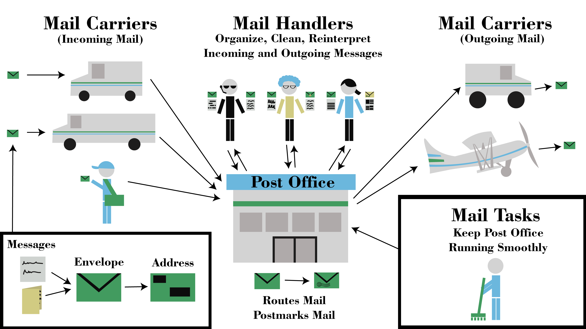
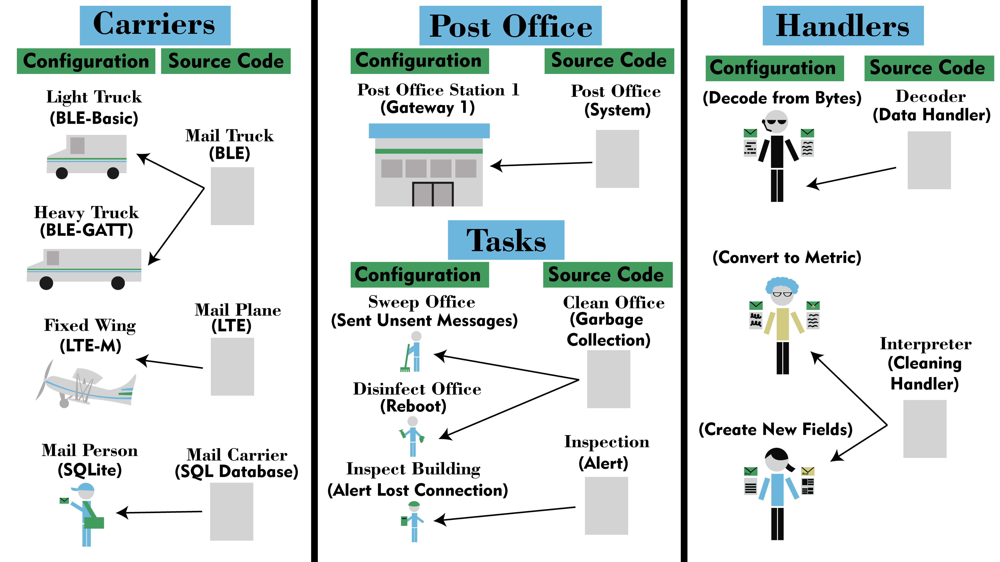
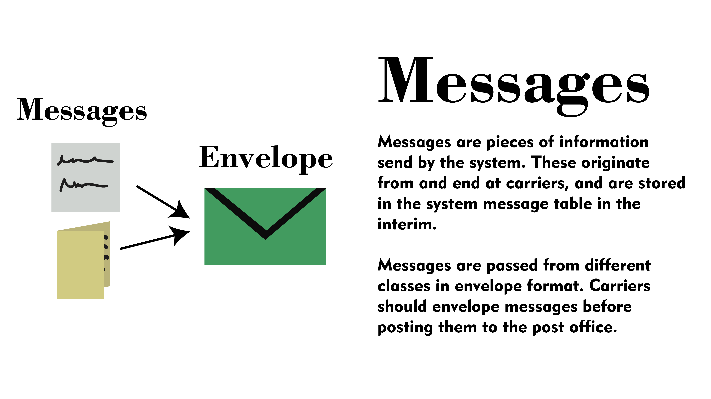
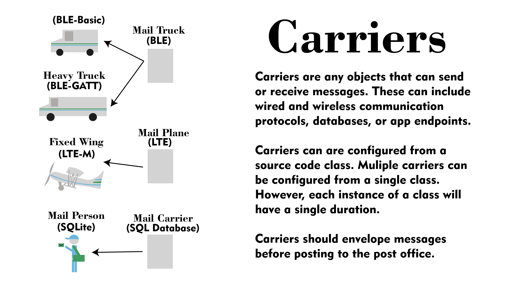
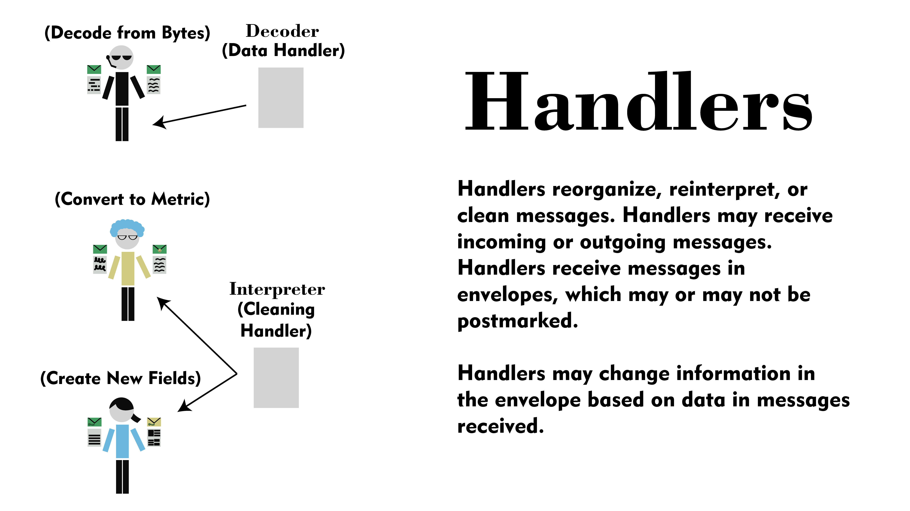
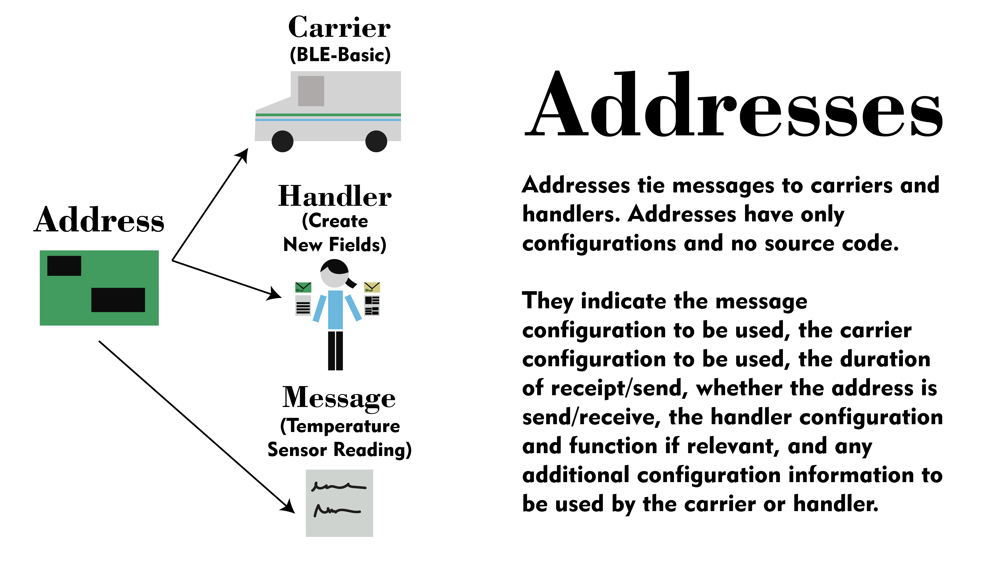
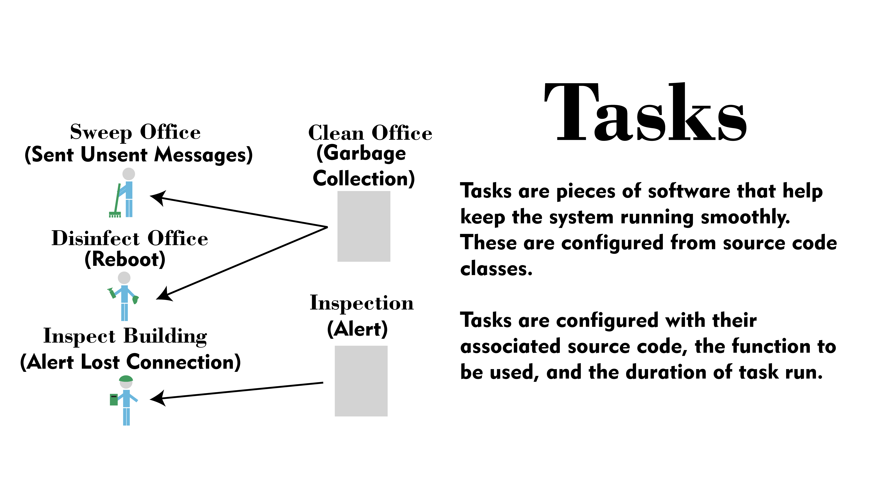
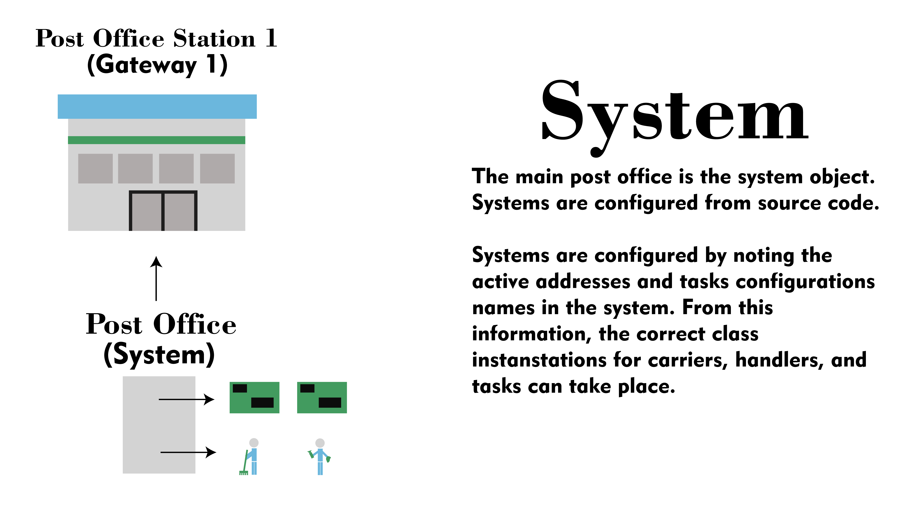

# SCARECRO 
The Sensor Collection and Remote Environment Care Reasoning Operation (SCARECRO) software repository. The communication protocol developed for this program is someting we call "SCARECRO POST" because it uses a post office analogy. 

## Goals 
The SCARECRO system is meant to be low-cost, open-source, flexible, and farmer-focused system to easily incorporate all kinds of outdoor sensors communicating a variety of protocols into a comprehensive ecosystem. This particular SCARECRO repository focuses on the sensor connectivity and routing aspects of wireless sensor networks. While SCARECRO is a system design, the implementation we use in-field utilizies a raspberry pi computer (running on a solar charger) with many plug and play peripherals to connect to different sensor types. 

## Usage
This SCARERCO repository is used to collect and route data from a variety of sensor sources on a variety of sensor protocols. You could configure a SCARECRO system to collect BLE beacon data from temp/humidity and store it to a Mongo Database. You could configure a SCARECRO system to rtl_433 radio to get weather station data and send it via MQTT. You could have a sensor wired to a raspberry pi and sent it to an App API every 5 minutes. And you could do all these things at once, at the same or different rates. 

## Status
This repository is a work in progress. An initial version of SCARECRO is implemented in several test areas. We are currently in the process of refactoring the software as we release it open-source. This process is meant to create more usable and better documented abstractions for different system components. However, the new software version has not yet been field tested. 

## Overview of the SCARECRO System 

### System Diagram

## Basic Concepts
There are two basic concepts to the SCARECRO system:

* __source code__: The actual software implementing a given class type or functionality, and 

* __configurations__: The configured instances of a class or function implemented in the source code. 

What's key is that there can be multiple configurations for one implementation of the source code. We have found that to be necessary to handle multiple types of communication protocol, message type, database, etc. 

## Basic Classes
There are several basic classes of object in the SCARECRO system. These are: 

* __messages__: These are the most basic type of configuration in the system. Messages must at least contain an id_field (to indicate what actor sent the message) and a time field (to indicate when the message was sent). [Messages are described in more detail here](messages.md)  

* __carriers__: Carriers send and receive messages. Their analogous component in the post office illustration could be a mail car, a mail truck, a door-to-door mail carrier, or even a mail plane. Carrier configurations should have, at minimum, a source field indicating the source code implementation of the carrier. [Carrier classes are described in more detail here](carrier_class.md)

* __handlers__: Handlers are objects that deal with message content, including structuring, reorganizing, interpreting, or reorganizing message content. Handlers may not be necessary in all cases, especially if a message comes ready to use from a sensor. Handlers can be different on a incoming or outgoing message, or may only be used in one or the other. Handler functionality could be implemented entirely within a carrier, but it is often useful to separate this functionality, especially when working with multiple different brands of sensors using the same communication protocol (like several bluetooth sensors with different manufacturers). Handler configurations, should, at minimum, have a source field which indicates their source code class implementation. 

Why are handlers necessary? Sometimes you might have a group of sensors that use related interpration or cleaning functions which are useful to have decoupled from the actual sending/receiving procotols, especially if those protocols are shared with others types of sensors or data sources. [Handler classes are described in more detail here](handler_class.md)

* __addresses__: The address configuration is necessary to actually send and receive messages, and ties together carriers, handlers, and messages. Configured addressed have an inheritance field (similar to the other objects) That allows them to inherit configuration values from other addresses, a message_type field indicating what type of message is to be sent or received (which can be a list, in which case the underlying system breaks into multiple addresses), a handler field indicating the name of the handler config to be used, a handler_function field, indicating the function name to be used on the handler class, a send_or_receive function, which can take the value "send" or "receive" to indicate if the address is incoming or outgoing, and a "duration" field. There are 4 possible durations: "always", (typically only relevant on a "receive" message), indicating that the the carrier should always be listening for this message, a value in seconds (integer value), which indicates how often the message will be sent or received, "on_message" (only releavant on a "send" message), indicating the message should be sent as soon as one is received, and "as_needed", which indicates the send or receive is triggered by something else and has no default triggering behavior. Finally, addresses have an "additional_info" field which should link to a dictionary of additional key-pairs that may relevant for any functionality in the system. For instance, certain carriers may requre per-message string matches. Some additional info may be implemented at the message level, or at the address level - programmer's choice. [Addresses are described in more detail here](addresses.md)

* __tasks__: Tasks are system(post office in the analogy)-specific functionality vital to keep the processes running smoothly. These are implemented somewhat similarly to addresses in that they have a specific duration and can either be implemented in standalone classes, or, in some instances, as part of carrier classes. [Tasks are described in more detail here](task_class.md)

* __system__: The system class is a special type of class to configure system parameters. [The system class is described in more detail here](system_class.md)

There are a couple of special system tasks that are also worth noting:

- [The Updater Class, used for updating system configs, described here](updater_class.md)
- [The Recovery Class, used for recoverying locally stored data for outages, described here](recovery.md)

## Example: 
To see an example of how you might set up the SCARECRO system, check out [an example system setup here](example.md)

## Currently implemented 
### Currently implemented carriers
* 433 MHz: receive-always
* MQTT: receive-always, receive-numeric, send-numeric
* BLE (in progress) - receive-always, receive-numeric 

### Currently implmented handlers 
* kkm_k6p: process function 
* renogy_solar_charger: process function

